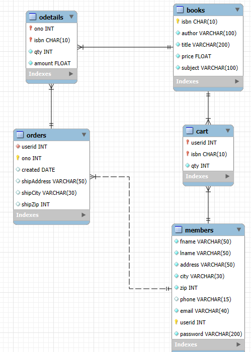

# book_store
A 3-tiered web application where a user can buy books (not connected to any real booking system). Created using JS, NodeJS, EJS and express for the front- and back- end. MySQL for the DB.

This is an assignment in the course 1DV503 Database technology at the Linnaeus University in Sweden.

## Start application

Create a database using MySQL following this Schema



Create and update an .env file (see an example at the end of this readme)

To run the application install all node modules by running:
`npm i`

Then to start a local development server run
`npm run dev`

## Assignment description

This is a web application that is run on the backend, rendering the front-end from the backend through routing. It should be built using NodeJS and a frontend framework (I'm using EJS). The main focus on the assignment is not the frontend though, but the backend, in particular the database and working with SQL through a DBMS, my database will be built using a MySQL DB.

A user should be able to sign up, login/logout, browse books and subsequently "buy" the books on their account.

| Tech | Use area |
|------|----------|
| JavaScript | Programming language |
| NodeJS | Main application framework |
| Express | Server base |
| EJS | Frontend framework |
| MySQL | DataBase |

## Tasks

- Create schemas for the DB according to the given relational model and populate the DB with the provided SQL file.

- Start building the base for the express server using routing.

- Implement basic reg, login and logout features (session cookies?)

- Implement browsing books by subject.

- Implement searching books by Author/Title

- Implement a check out system for the books.

## ENV

It needs a .env file to fetch the data to connect to both the database and open a session. Example of the .env structure (change to your own strings):

```ini
BASE_URL = '/'
NODE_ENV = 'development' ('production' when deployed)
PORT = 9999
SESSION_NAME = sessionnamestring
SESSION_SECRET = secretstringusedtohashthesessionwithHMAC

DB_HOST = localhost
DB_USER = databaseUser
DB_PASSWORD = databasePassword
DB_NAME = databaseName
```